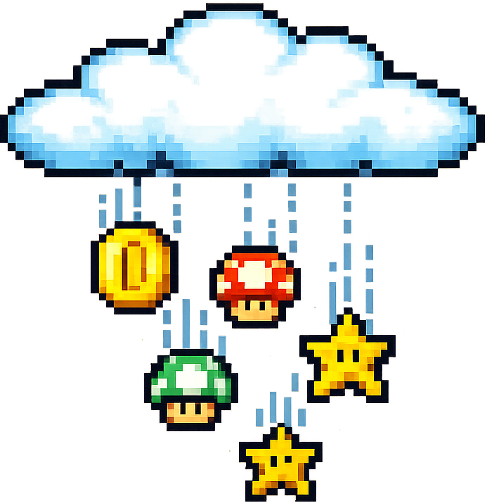

# RainMoji



[](https://www.npmjs.com/package/@thejesper/rainmoji)
[](LICENSE)

Beautiful emoji rain animations for any website. The standalone widget has zero runtime dependencies (~7.2KB minified, about 2.7KB gzipped). React component is an optional package entry point.

**[Live Demo & Widget Generator](https://rainmoji.vs-code.com)** | **[npm](https://www.npmjs.com/package/@thejesper/rainmoji)**

The demo website's generated snippets load the current public `main` build from jsDelivr.

## Quick Start — With Button

```html
<script src="https://cdn.jsdelivr.net/gh/TheJesper/rainmoji@main/dist/widget.min.js"></script>
<button id="rainmoji-trigger" style="padding: 12px 24px; font-size: 16px; cursor: pointer;">
  🌧️ Make it Rain!
</button>
<script>
  EmojiRain.init({
    emojis: ['🎉', '🎊', '🎁', '🎈', '✨', '🌟'],
    triggerElement: '#rainmoji-trigger',
    autoPlay: false
  });
</script>
```

## Quick Start — Programmatic

```html
<script src="https://cdn.jsdelivr.net/gh/TheJesper/rainmoji@main/dist/widget.min.js"></script>
<script>
  const rain = EmojiRain.init({
    emojis: ['🎉', '🎊', '✨', '🌟'],
    autoPlay: false
  });

  rain.start();   // trigger a rain burst
  rain.stop();    // stop continuous rain
  rain.clear();   // remove all visible emojis
  rain.destroy(); // remove widget entirely
</script>
```

## npm

```bash
npm install @thejesper/rainmoji
```

The npm package is released from this public repository. The website's CDN snippets use the current `main` branch build.

```tsx
import { EmojiRain } from '@thejesper/rainmoji';

function App() {
  return <EmojiRain emojiSet={['🌟', '💫', '✨']} autoPlay={true} />;
}
```

## Options

| Option | Type | Default | Description |
|--------|------|---------|-------------|
| `emojis` | `string[]` | `['🎉', '🎊', ...]` | Emojis to rain |
| `baseSpeed` | `number` | `25` | Animation speed (0-100) |
| `autoPlay` | `boolean` | `false` | Start immediately |
| `parallaxEnabled` | `boolean` | `true` | 3D parallax depth layers |
| `blurEnabled` | `boolean` | `true` | Depth blur effect |
| `windDirection` | `number` | `0` | Wind drift (-100 left to 100 right) |
| `bounceEnabled` | `boolean` | `false` | Add bounce effect to emojis |
| `mobileOptimization` | `boolean` | `true` | Reduce particles on mobile (<768px) |
| `triggerElement` | `string` | `null` | CSS selector for button that triggers rain |
| `targetElement` | `string \| HTMLElement` | `null` | CSS selector or DOM element that contains the rain |
| `showControls` | `boolean` | `false` | Show built-in control panel |
| `containerZIndex` | `number` | `10` | Z-index of rain container; higher values put rain in front of page content |
| `layerRatios` | `object` | `{front:100, middle:300, back:70}` | Emoji count per layer |
| `zIndexMode` | `string` | `'individual'` | Z-index strategy |
| `layerProperties` | `object` | See below | Per-layer config |

### Layer Properties

```javascript
layerProperties: {
  front:  { speedRange: [0, 2],  blurRange: [1, 2], zIndex: 3, fontSizeRange: [48, 72], delayRange: [0, 0.2] },
  middle: { speedRange: [4, 6],  blurRange: [0, 0], zIndex: 2, fontSizeRange: [16, 32], delayRange: [0, 0.1] },
  back:   { speedRange: [7, 10], blurRange: [2, 3], zIndex: 1, fontSizeRange: [8, 14],  delayRange: [0, 0.2] }
}
```

## API Methods

| Method | Description |
|--------|-------------|
| `rain.start()` | Trigger a rain burst |
| `rain.stop()` | Stop continuous rain |
| `rain.clear()` | Remove all visible emojis |
| `rain.updateConfig({...})` | Update config at runtime |
| `rain.destroy()` | Remove widget entirely |

## Examples

```javascript
// Celebration with button
EmojiRain.init({
  emojis: ['🎉', '🎊', '🎈', '🎁'],
  triggerElement: '#my-button'
});

// Ambient background
EmojiRain.init({
  emojis: ['✨', '💫', '🌟'],
  autoPlay: true,
  baseSpeed: 30,
  containerZIndex: 1
});

// Holiday themes
EmojiRain.init({ emojis: ['🎃', '👻', '🦇', '🕷️'] }); // Halloween
EmojiRain.init({ emojis: ['❄️', '⛄', '🎄', '🎅'] }); // Christmas
EmojiRain.init({ emojis: ['❤️', '💕', '💖', '💝'] }); // Valentine's

// Wind and bounce effects
EmojiRain.init({
  emojis: ['🍂', '🍁'],
  windDirection: -50, // Drift left
  bounceEnabled: true,
  autoPlay: true
});
```

## Features

- **Parallax layers** — Front, middle, and back with configurable depth
- **Trigger button** — Bind rain to any button with `triggerElement`
- **Full API** — start, stop, clear, updateConfig, destroy
- **Auto-cleanup** — Emojis removed from DOM after animation
- **GPU accelerated** — CSS transforms for smooth 60fps
- **Container mode** — Rain inside any element, or full viewport
- **Mobile friendly** — Works on all devices

## SSR Support

RainMoji works with SSR frameworks like Next.js, but requires client-side rendering:

### Next.js (App Router)

```tsx
'use client';
import { useEffect } from 'react';

export default function ClientRain() {
  useEffect(() => {
    const script = document.createElement('script');
    script.src = 'https://cdn.jsdelivr.net/gh/TheJesper/rainmoji@main/dist/widget.min.js';
    script.onload = () => {
      window.EmojiRain.init({ emojis: ['🎉', '✨'], autoPlay: true });
    };
    document.body.appendChild(script);
  }, []);
  return null;
}
```

### Next.js (Pages Router)

```tsx
import dynamic from 'next/dynamic';

const EmojiRain = dynamic(() => import('@thejesper/rainmoji').then(m => m.EmojiRain), {
  ssr: false
});

export default function Page() {
  return <EmojiRain emojiSet={['🎉', '✨']} autoPlay />;
}
```

### Nuxt.js

```vue
<template>
  <ClientOnly>
    <div id="rain-container"></div>
  </ClientOnly>
</template>

<script setup>
onMounted(() => {
  const script = document.createElement('script');
  script.src = 'https://cdn.jsdelivr.net/gh/TheJesper/rainmoji@main/dist/widget.min.js';
  script.onload = () => {
    window.EmojiRain.init({ emojis: ['🎉', '✨'], autoPlay: true });
  };
  document.body.appendChild(script);
});
</script>
```

## Framework Adapters

### Vue 3

```vue
<template>
  <div ref="container" class="emoji-rain"></div>
</template>

<script setup>
import { ref, onMounted, onBeforeUnmount } from 'vue';

const props = defineProps({
  emojis: { type: Array, default: () => ['🎉', '✨', '🌟'] },
  autoPlay: { type: Boolean, default: false }
});

const container = ref(null);
let rainInstance = null;

onMounted(() => {
  const script = document.createElement('script');
  script.src = 'https://cdn.jsdelivr.net/gh/TheJesper/rainmoji@main/dist/widget.min.js';
  script.onload = () => {
    rainInstance = window.EmojiRain.init({
      emojis: props.emojis,
      autoPlay: props.autoPlay,
      targetElement: container.value
    });
  };
  document.body.appendChild(script);
});

onBeforeUnmount(() => {
  if (rainInstance) rainInstance.destroy();
});
</script>
```

### Svelte

```svelte
<script>
  import { onMount, onDestroy } from 'svelte';

  export let emojis = ['🎉', '✨', '🌟'];
  export let autoPlay = false;

  let rainInstance;

  onMount(() => {
    const script = document.createElement('script');
    script.src = 'https://cdn.jsdelivr.net/gh/TheJesper/rainmoji@main/dist/widget.min.js';
    script.onload = () => {
      rainInstance = window.EmojiRain.init({ emojis, autoPlay });
    };
    document.body.appendChild(script);
  });

  onDestroy(() => {
    if (rainInstance) rainInstance.destroy();
  });
</script>

<div class="emoji-rain"></div>
```

## Build

```bash
git clone https://github.com/TheJesper/rainmoji.git
cd rainmoji
npm install
npm test
npm run lint
npm run typecheck
npm run build:all
```

## License

MIT License — Copyright (c) 2025 [Jesper Wilfing](https://conzeon.com) / [Conzeon AB](https://conzeon.com)

## Links

- [Live Demo & Widget Generator](https://rainmoji.vs-code.com)
- [Landing Page Repo](https://github.com/TheJesper/rainmoji-web)
- [npm Package](https://www.npmjs.com/package/@thejesper/rainmoji)

---

Built by [Jesper Wilfing](https://conzeon.com) / [Conzeon AB](https://conzeon.com)
